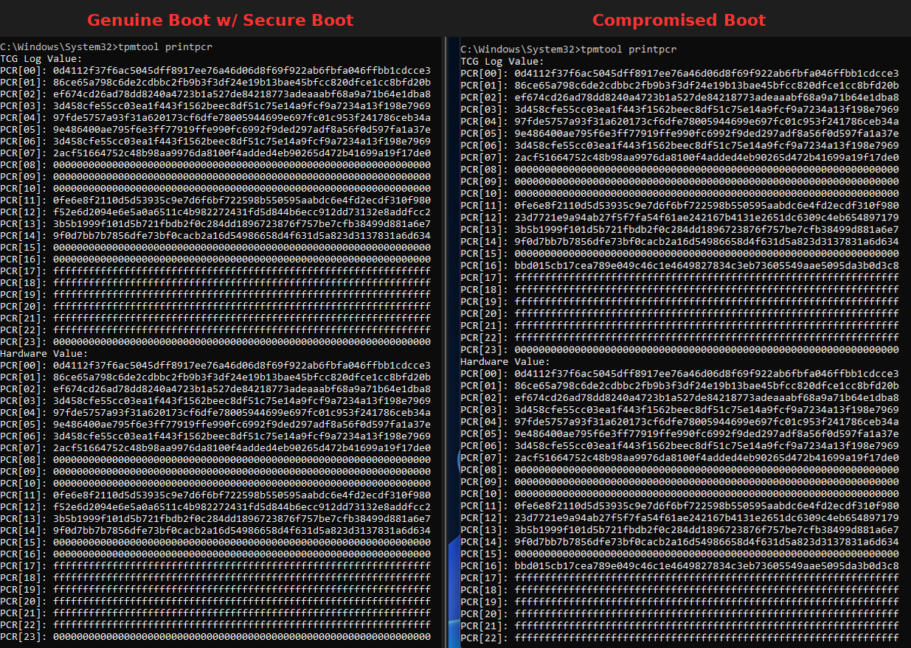

# insecure-boot

[](#disclaimer)
[](#license)
[](#building)
[](#repository-layout)
[](#repository-layout)

**insecure-boot** is a proof of concept that breaks TPM-based measured-boot
attestation on real, Secure-Boot-enabled x86_64 Windows hardware. It runs an
**unsigned** EFI application and then boots Windows itself, and leaves the
TPM's PCR banks and the TCG event log looking exactly like those of a
genuine, clean Secure Boot boot — record for record, with no trace of the
shim, the machine-owner key, or the payload.

To anything that attests this machine — locally or remotely — nothing
happened. That is the finding.

<p align="center">
  
</p>

<p align="center"><em>The SHA-256 PCR banks after a genuine Secure Boot boot,
and after an insecure-boot detour that ran unsigned code first: the same.</em></p>

> [!WARNING]
> This is a security research demonstration. It is one-shot, consent-gated,
> and self-erasing: nothing it stages runs without a physical-presence
> confirmation, and the boot it detour is restored before Windows starts.
> Run it only on hardware you own and are authorized to test.

## The vulnerability

Measured-boot attestation rests on a single assumption: the values in the
TPM's PCR banks got there because the platform firmware, and only the
firmware, extended them while measuring each stage of the boot chain.
Nothing in the system enforces that assumption — it is a property of the
firmware configuration, and firmware configurations can be wrong.

The specific wrong one: most UEFI setups expose a *TPM UEFI spec version*
option. Set it to **TCG 1.2** instead of TCG 2.0 and the firmware never runs
TPM 2.0 measured boot — while the TPM 2.0 device itself sits on its Command
Response Buffer interface, fully functional, with its **SHA-256 PCR banks
still at their zero reset values**. Optionally disabling the SHA-1 bank
takes the legacy 1.2 measurement path down too, leaving every bank empty.

Any code that runs before the operating system can then extend a *recorded*
genuine boot chain into those empty banks and publish an event log that
matches. insecure-boot does exactly that, and Windows boots into an
attestation state indistinguishable from the real thing.

## Why the Red Hat shim

The attack needs `GetVariable(SecureBoot)` to return `TRUE` — attestation
consumers check it — without hooking `GetVariable` or patching anything the
OS could notice. The [shim](https://github.com/rhboot/shim) provides exactly
that: it is Microsoft-signed and chains from `db`, so Secure Boot stays
genuinely enabled, and it runs a Machine-Owner-Key-signed second stage, so
unsigned code still gets to run before Windows. That is the shim's only job
here — a hook-free way to have both properties at once.

Ordinarily the shim measures itself and its second stage into PCR4 and PCR7,
which would leave precisely the tell-tale events this proof of concept needs
to avoid. Under the TCG 1.2 setting those measurements never reach the
SHA-256 banks, so the shim passes through silently. As a second line, the
loader's own protocol drops every measurement into PCR0 through PCR7
regardless of who makes it.

## The chain

```
 reference machine                          target machine
 ────────────────                           ──────────────
 Windows boots normally                     ib-install.exe  (elevated, once)
 ib-tcg-dump.exe                            ├─ signs ib-loader.efi with the MOK
 └─▶ tcglog.ib ───────────────────────────▶ ├─ stages dump, payload, and shim chain
     (the genuine boot's                    ├─ backs up bootmgfw.efi
      event log)                            └─ writes the MOK enrollment request

                                            boot:
                                              firmware ─▶ shim  (db-signed)
                                                           └─▶ MokManager  (asks once)
                                                                 └─▶ ib-loader.efi  (MOK-signed)
                                                                       ├─ restore bootmgfw.efi
                                                                       ├─ wipe every staged file
                                                                       ├─ replay tcglog.ib into PCR0–PCR7
                                                                       ├─ install EFI_TCG2_PROTOCOL
                                                                       ├─ run the unsigned payload
                                                                       └─ chain-load bootmgfw.efi
                                                                             └─▶ Windows
```

Step by step:

1. **Record.** On a genuine boot of the platform — firmware in TCG 2.0 mode —
   `ib-tcg-dump.exe` reads the real TCG event log and writes it out as
   `tcglog.ib`.
2. **Reconfigure.** In UEFI setup: TPM UEFI spec version → **TCG 1.2**, SHA-1
   bank optionally disabled, Secure Boot left **on**.
3. **Stage.** `ib-install.exe` signs `ib-loader.efi` with a locally generated
   MOK key, stages the shim over `bootmgfw.efi`, the signed loader as
   `grubx64.efi`, MokManager as `mmx64.efi`, and the dump and payload in the
   ESP root — restoring the original boot manager and rolling everything back
   if any step fails.
4. **Consent.** On the next boot, MokManager asks the user, physically
   present, whether to enroll the key. Nothing runs without that yes.
5. **Detour.** The loader restores the real `bootmgfw.efi` and securely wipes
   every staged artifact, brings up ACPI through
   [uACPI](https://github.com/uACPI/uACPI), drives the TPM 2.0 directly over
   its CRB interface, and replays the dump's events into the zeroed SHA-256
   banks in log order — the only order that reproduces the recorded values.
6. **Impersonate.** It installs its own `EFI_TCG2_PROTOCOL` — displacing
   every TCG interface the firmware had — whose `GetEventLog` returns the
   replayed log and whose final-events table is what the OS reads after boot
   services end. Measurements into PCR0–PCR7 through it succeed and are
   dropped, keeping the replayed state intact.
7. **Payload.** The unsigned EFI application is mapped into memory by hand
   and called — `LoadImage` would refuse it — and afterwards the restored
   Windows boot manager is chain-loaded from its own device path.

## What the attester sees

| Signal | Genuine boot | insecure-boot |
| --- | --- | --- |
| `SecureBoot` variable | `TRUE` | `TRUE` — genuinely enforced, for the shim |
| PCR0–PCR7 (SHA-256) | firmware-measured | identical: the replayed dump's values |
| TCG event log | genuine | identical, record for record |
| PCR4 | bootmgr / winload measurements | same as genuine — shim and loader are never measured |
| PCR7 | Secure Boot policy events | same as genuine — no MOK, no shim events |
| Final events table | post-handoff measurements | served by the loader's protocol |

A TPM quote over the replayed banks, replayed against the replayed log,
reconstructs perfectly — the log *is* the source of the bank contents. The
deception is not a forged log; it is an empty TPM filled from a real one.

## Repository layout

| Path | What it is |
| --- | --- |
| `crates/ib-loader` | The UEFI application: restore, wipe, replay, install, payload, chain-load |
| `crates/ib-tcg2` | The `EFI_TCG2_PROTOCOL` implementation and its displacement of firmware's |
| `crates/ib-tcglog` | The `tcglog.ib` replay-dump format |
| `crates/ib-tpm-crb` | TPM 2.0 Command Response Buffer driver |
| `crates/ib-tpm2` | TPM 2.0 command and reply marshalling |
| `crates/ib-uacpi`, `crates/uacpi-sys` | uACPI host primitives and bindings, built for the UEFI ABI |
| `host/ib-install` | Windows host tool: MOK key, authenticode signing, ESP staging |
| `host/ib-tcg-dump` | Windows host tool: records a genuine boot's event log |

## Building

Firmware side (needs `clang`, `llvm-ar`, and `libclang` for the uACPI
sources and bindings):

```sh
git submodule update --init
cargo build --release        # target/x86_64-unknown-uefi/release/ib-loader.efi
```

Host side, from `host/` — `ib-install` cross-compiles from Linux for
Windows:

```sh
cargo build --release --target x86_64-unknown-linux-gnu    # tcg-dump, and local testing
cargo build --release --target x86_64-pc-windows-gnu       # ib-install.exe
```

Smoke-testing the loader under OVMF with a software TPM behind a CRB
interface:

```sh
mkdir -p esp/EFI/BOOT tpmstate
cp target/x86_64-unknown-uefi/release/ib-loader.efi esp/EFI/BOOT/BOOTX64.EFI
cp /usr/share/edk2/x64/OVMF_VARS.4m.fd vars.fd
swtpm socket --tpm2 --tpmstate dir=tpmstate --ctrl type=unixio,path=swtpm.sock \
  --flags not-need-init,startup-clear --daemon
qemu-system-x86_64 -machine q35 -m 512 \
  -drive if=pflash,format=raw,readonly=on,file=/usr/share/edk2/x64/OVMF_CODE.4m.fd \
  -drive if=pflash,format=raw,file=vars.fd \
  -drive format=raw,file=fat:rw:esp \
  -chardev socket,id=chrtpm,path=swtpm.sock \
  -tpmdev emulator,id=tpm0,chardev=chrtpm \
  -device tpm-crb,tpmdev=tpm0 \
  -display none -serial stdio -net none
```

Dropping the last three device options boots a machine with no TPM, which is
the other path worth checking.

## Disclaimer

This project demonstrates a weakness in a configuration, on hardware its
author owns, for the purpose of getting that configuration treated as the
security boundary it is. It is not an implant: it takes effect only after a
user confirms enrollment in person, runs once, deletes its own artifacts,
and restores the boot chain it borrowed. Do not run it on hardware you do
not own or are not authorized to test.

## License

Dual-licensed under [MIT](LICENSE-MIT) or
[Apache-2.0](LICENSE-APACHE), at your option.
